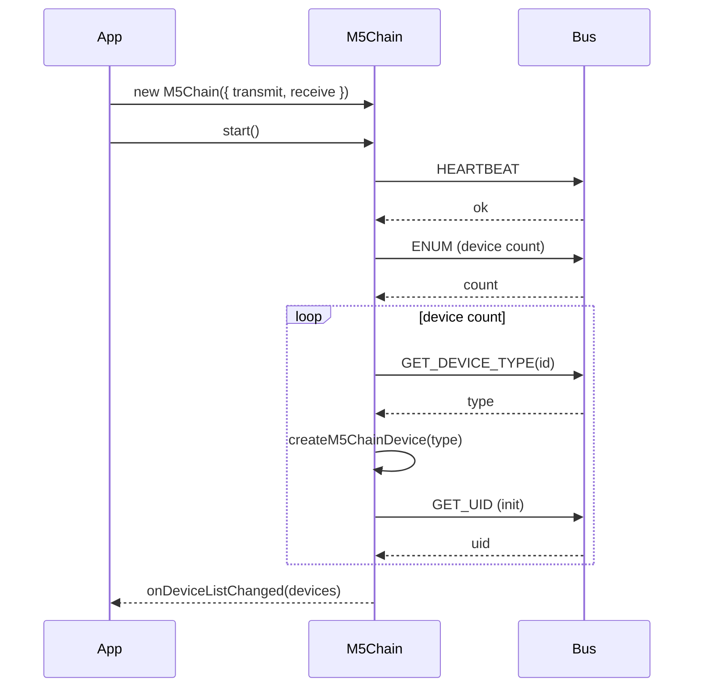
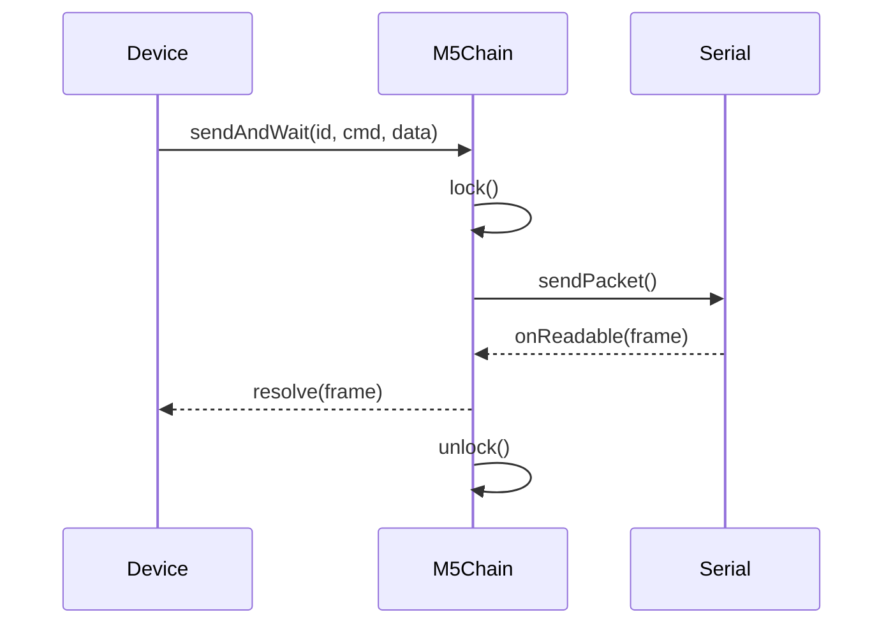
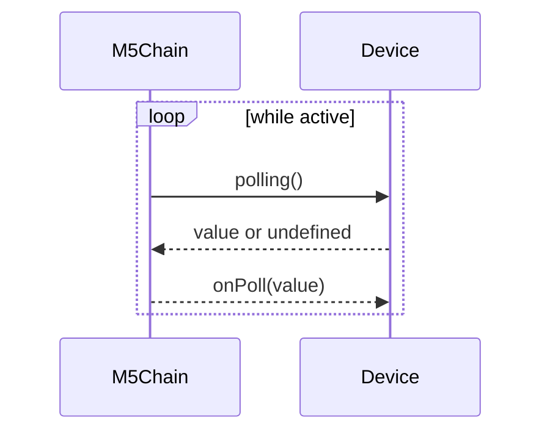

# moddable-m5chain (Developer/AI Guide)

This document is developer‑ and AI‑oriented overview of the repository. It summarizes the purpose, structure, and core runtime sequences. Mermaid diagrams are included where they add clarity.

## Overview

`moddable-m5chain` is a Moddable SDK module for controlling M5Chain devices over a serial bus. It handles device enumeration, initialization, polling, and event dispatch, then exposes device‑specific APIs via feature mixins.

## Key Features

- Unified packet framing via `sendPacket` / `waitForPacket`
- Automatic enumeration and re‑enumeration (`ENUM_PLEASE`)
- Device instantiation by type (`createM5ChainDevice`)
- Feature mixins: `HasLed`, `HasKey`, `CanPoll`
- Polling loop only runs while at least one device has an active `onPoll` listener

## Repository Structure

### Core

- `modules/m5chain/m5chain.js`
- `modules/m5chain/createM5ChainDevice.js`
- `modules/m5chain/m5chainDevices/m5chainDevice.js`

### Device Types

- `modules/m5chain/m5chainDevices/m5chainEncoder.js`
- `modules/m5chain/m5chainDevices/m5chainAngle.js`
- `modules/m5chain/m5chainDevices/m5chainKey.js`
- `modules/m5chain/m5chainDevices/m5chainJoyStick.js`
- `modules/m5chain/m5chainDevices/m5chainToF.js`

### Device Protocol PDFs

| Device | One‑line Summary | Protocol PDF |
| --- | --- | --- |
| Encoder | Rotary encoder with RGB LED + key + polling support | [M5Stack-Chain-Encoder-Protocol-EN.pdf](https://m5stack-doc.oss-cn-shenzhen.aliyuncs.com/1200/M5Stack-Chain-Encoder-Protocol-EN.pdf) |
| Angle | Angle sensor with RGB LED + polling support | [M5Stack-Chain-Angle-Protocol-EN.pdf](https://m5stack-doc.oss-cn-shenzhen.aliyuncs.com/1197/M5Stack-Chain-Angle-Protocol-EN.pdf) |
| Key | Single key with RGB LED | [M5Stack-Chain-Key-Protocol-EN.pdf](https://m5stack-doc.oss-cn-shenzhen.aliyuncs.com/1192/M5Stack-Chain-Key-Protocol-EN.pdf) |
| JoyStick | 2‑axis joystick with RGB LED + key + polling support | [M5Stack-Chain-Joystick-Protocol-EN.pdf](https://m5stack-doc.oss-cn-shenzhen.aliyuncs.com/1191/M5Stack-Chain-Joystick-Protocol-EN.pdf) |
| ToF | Time‑of‑Flight distance sensor | [M5Stack-Chain-ToF-Protocol-EN.pdf](https://m5stack-doc.oss-cn-shenzhen.aliyuncs.com/1199/M5Stack-Chain-ToF-Protocol-EN.pdf) |

### Feature Mixins

- `modules/m5chain/deviceFeatures/hasLed.js`
- `modules/m5chain/deviceFeatures/hasKey.js`
- `modules/m5chain/deviceFeatures/canPoll.js`

### Manifests / Config

- `modules/m5chain/manifest_module.json`
- `modules/m5chain/manifest_include.json`
- `modules/m5chain/manifest_chain_base.json`

### Examples

- `examples/basic/mod.js`
- `examples/led/mod.js`

## Architecture Summary

### Device Creation

`createM5ChainDevice` maps device types to concrete classes and returns a device instance. Each class composes features via `withDeviceFeatures(...)`.

### Mixins

- `HasLed`: RGB LED control
- `HasKey`: key status and key event dispatch
- `CanPoll`: polling hook, activates the polling loop when `onPoll` is set

### Packet Frame

Packets follow a fixed frame format:

- Header: `0xAA 0x55`
- Length: 2 bytes (`id/cmd/data/crc` length)
- Payload: `id`, `cmd`, `data...`, `crc8`
- Footer: `0x55 0xAA`

## Sequences

### Startup and Enumeration



### Request/Response Flow



### Polling Loop



## Minimal Usage

```js
import M5Chain from "m5chain";

const m5chain = new M5Chain({ transmit, receive });

m5chain.onDeviceListChanged = (devices) => {
  for (const device of devices) {
    // register device-specific handlers by device.type
  }
};

m5chain.start();
```
