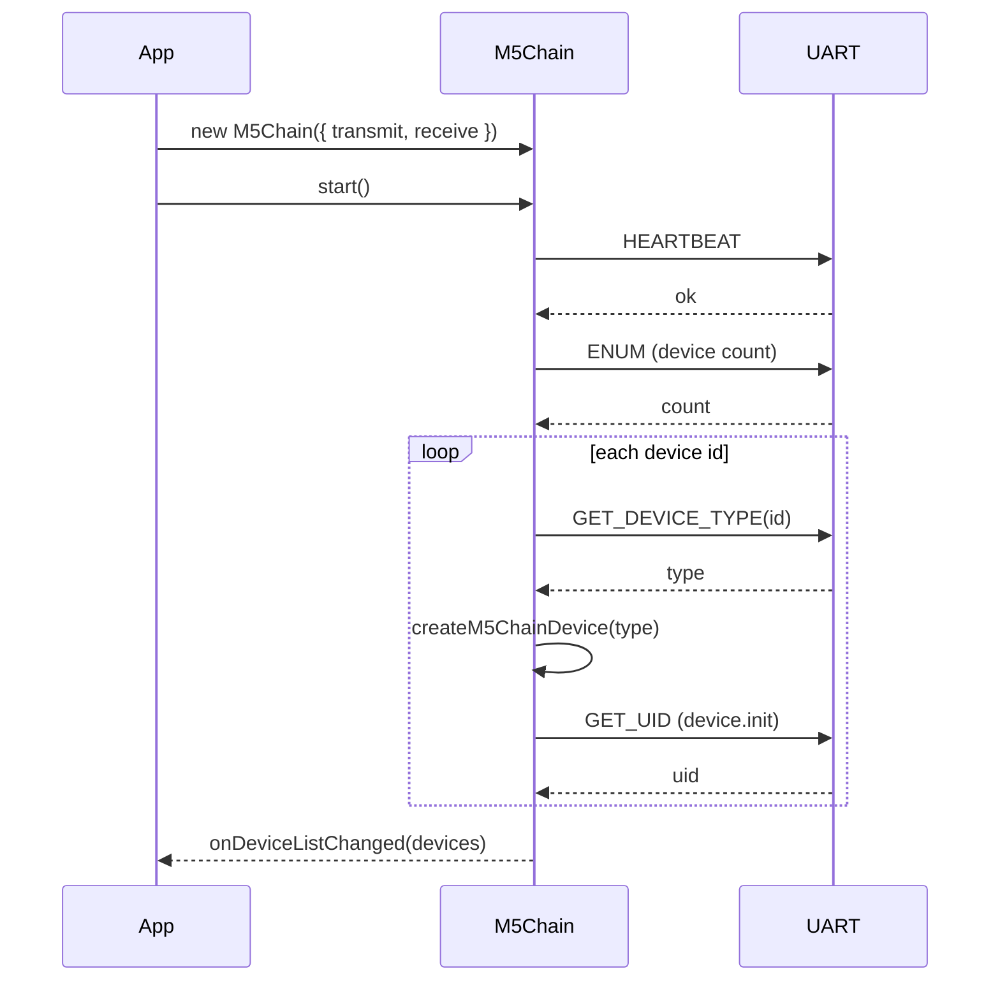
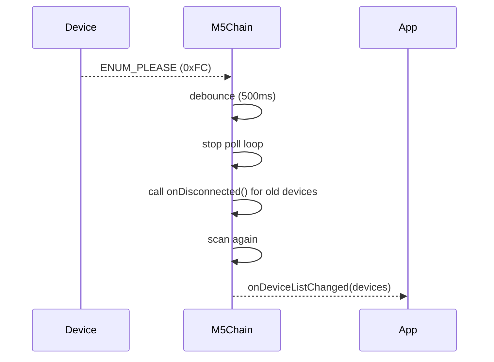
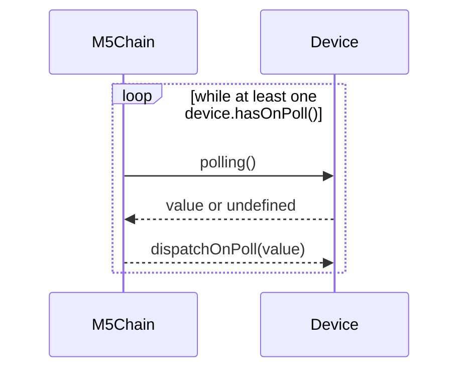

# moddable-m5chain (Developer/AI Guide)

This document is a developer- and AI-oriented overview of the repository. It summarizes current structure and runtime behavior based on the implementation in this repo.

## Overview

`moddable-m5chain` is a Moddable SDK module for controlling M5Chain devices over a UART bus. It handles scanning, initialization, polling, and event dispatch, then exposes device-specific APIs via feature mixins.

## Key Features

- Packet framing + parsing via `sendPacket` / `waitForPacket`
- Type-based device instantiation via `createM5ChainDevice`
- Automatic re-scan when `ENUM_PLEASE (0xFC)` arrives (debounced)
- Feature composition via `withDeviceFeatures(...)`
- Poll loop runs only while at least one device has `onPoll` set

## Repository Structure

### Core

- `src/m5chain/m5chain.js` (bus communication, scan/re-scan, poll loop, dispatch)
- `src/m5chain/createM5ChainDevice.js` (device type -> class mapping)
- `src/m5chain/m5chainDevices/m5chainDevice.js` (base class + feature composition)
- `src/m5chain/m5chainDevices/m5chainBus.js` (bus-typed device placeholder)

### Device Types

- `src/m5chain/m5chainDevices/m5chainEncoder.js`
- `src/m5chain/m5chainDevices/m5chainAngle.js`
- `src/m5chain/m5chainDevices/m5chainKey.js`
- `src/m5chain/m5chainDevices/m5chainJoyStick.js`
- `src/m5chain/m5chainDevices/m5chainToF.js`

### Feature Mixins

- `src/m5chain/deviceFeatures/hasLed.js`
- `src/m5chain/deviceFeatures/hasKey.js`
- `src/m5chain/deviceFeatures/canPoll.js`

### Manifests / Config

- `src/m5chain/manifest.json`
- `src/m5chain/manifest_module.json`
- `src/m5chain/manifest_include.json`
- `src/m5chain/manifest_chain_base.json`
- `examples/manifest.json`
- `examples/main.js`

### Examples (current)

- `examples/basic/mod.js`
- `examples/led/mod.js`

### Device Protocol PDFs

| Device | One-line Summary | Protocol PDF |
| --- | --- | --- |
| Encoder | Rotary encoder with RGB LED + key + polling support | [M5Stack-Chain-Encoder-Protocol-EN.pdf](https://m5stack-doc.oss-cn-shenzhen.aliyuncs.com/1200/M5Stack-Chain-Encoder-Protocol-EN.pdf) |
| Angle | Angle sensor with RGB LED + polling support | [M5Stack-Chain-Angle-Protocol-EN.pdf](https://m5stack-doc.oss-cn-shenzhen.aliyuncs.com/1197/M5Stack-Chain-Angle-Protocol-EN.pdf) |
| Key | Single key with RGB LED | [M5Stack-Chain-Key-Protocol-EN.pdf](https://m5stack-doc.oss-cn-shenzhen.aliyuncs.com/1192/M5Stack-Chain-Key-Protocol-EN.pdf) |
| JoyStick | 2-axis joystick with RGB LED + key + polling support | [M5Stack-Chain-Joystick-Protocol-EN.pdf](https://m5stack-doc.oss-cn-shenzhen.aliyuncs.com/1191/M5Stack-Chain-Joystick-Protocol-EN.pdf) |
| ToF | Time-of-Flight distance sensor | [M5Stack-Chain-ToF-Protocol-EN.pdf](https://m5stack-doc.oss-cn-shenzhen.aliyuncs.com/1199/M5Stack-Chain-ToF-Protocol-EN.pdf) |

## Architecture Summary

### Device Creation

`createM5ChainDevice` selects a device class by `DEVICE_TYPE` and returns an instance.  
Each concrete class composes feature mixins via `withDeviceFeatures(...)`.

### Mixins

- `HasLed`: RGB LED API
- `HasKey`: key polling/config API + key event callback
- `CanPoll`: `onPoll` hook + polling integration with bus state

### Packet Frame

Packets use this frame:

- Header: `0xAA 0x55`
- Length: 2 bytes, little-endian (`id/cmd/data/crc` byte count)
- Payload: `id`, `cmd`, `data...`, `crc8`
- Footer: `0x55 0xAA`

### Request Matching

`sendAndWait(id, cmd, ...)` resolves only when both `id` and `cmd` match the response frame.  
This prevents misrouting when delayed packets arrive.

## Sequences

### Startup and Scan



### Re-scan on `ENUM_PLEASE`



### Poll Loop



## Minimal Usage

```js
import M5Chain from "m5chain";

const m5chain = new M5Chain({ transmit, receive });

m5chain.onDeviceListChanged = (devices) => {
	for (const device of devices) {
		// attach device-specific callbacks by device.type
	}
};

m5chain.start();
```

## Implementation Requests

When asking for changes, the following expectations apply:

- Refactors are welcome.
- Please commit and report in clean, sensible units.
- Breaking API changes are acceptable.
- If code changes, update documentation accordingly.
- For implementation changes, run `npm run format` and `npm run lint`, then address reported lint findings.
