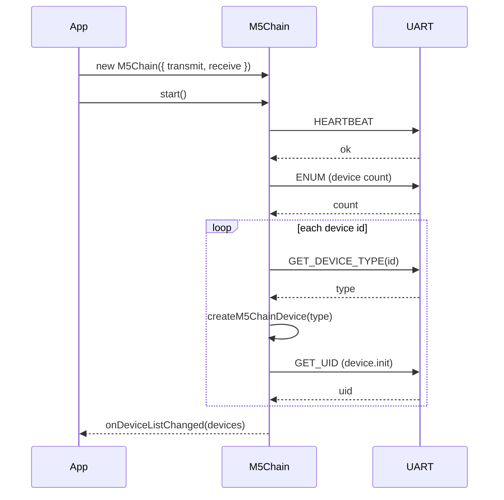
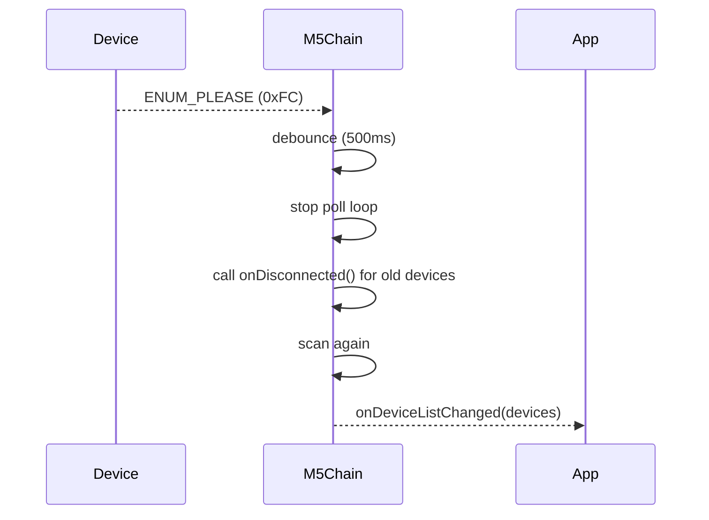
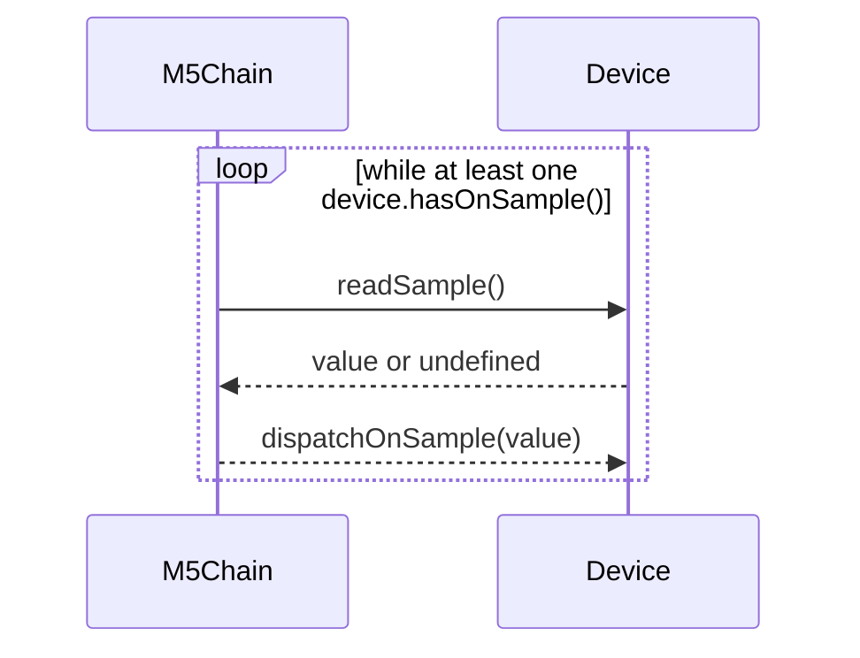

# moddable-m5chain (Developer/AI Guide)

This document is a developer- and AI-oriented overview of the repository. It summarizes current structure and runtime behavior based on the implementation in this repo.

For general Moddable SDK development and validation rules, follow `$MODDABLE/AGENTS.md`. This file only adds guidance specific to this repository.

## Overview

`moddable-m5chain` is a Moddable SDK module for controlling M5Chain devices over a UART bus. It handles scanning, initialization, serial-bus polling, sample notification, and event dispatch, then exposes device-specific APIs via feature mixins.

## Key Features

- UART is adapted to `ReadableStream<Uint8Array>` and `WritableStream<Uint8Array>`; packet framing and parsing remain in `M5Chain`
- Applications may inject an `M5ChainTransport` stream pair for desktop simulation and protocol tests
- Application-selected, type-based device instantiation via `deviceClasses` and `createM5ChainDevice`
- Automatic re-scan when `ENUM_PLEASE (0xFC)` arrives (debounced)
- Feature composition via `withDeviceFeatures(...)`
- Poll loop runs only while at least one device has `onSample` set
- Sample-capable public APIs use `onSample(sample)` notifications and a synchronous `sample()` accessor for the latest cached value

## Repository Structure

### Core

- `src/m5chain/m5chain.ts` (bus communication, scan/re-scan, poll loop, dispatch)
- `src/m5chain/serialTransport.ts` (ECMA-419 Serial -> Web Streams adapter)
- `src/m5chain/createM5ChainDevice.ts` (registered device type -> class mapping)
- `src/m5chain/m5chainDevices/m5chainDevice.ts` (base class + feature composition)
- `src/m5chain/m5chainDevices/m5chainBus.ts` (bus-typed device placeholder)

### Device Types

- `src/m5chain/m5chainDevices/m5chainEncoder.ts`
- `src/m5chain/m5chainDevices/m5chainAngle.ts`
- `src/m5chain/m5chainDevices/m5chainKey.ts`
- `src/m5chain/m5chainDevices/m5chainJoyStick.ts`
- `src/m5chain/m5chainDevices/m5chainToF.ts`
- `src/m5chain/m5chainDevices/m5chainPIR.ts`

### Feature Mixins

- `src/m5chain/deviceFeatures/hasLed.ts`
- `src/m5chain/deviceFeatures/hasKey.ts`
- `src/m5chain/deviceFeatures/canSample.ts`

### Manifests / Config

- `manifest.json` (standalone all-device entry point)
- `src/m5chain/manifest_mod.json` (all-device Mod convenience manifest)
- `src/m5chain/manifest_mod_base.json` (Host-provided core typings for Mods)
- `src/m5chain/manifest_devices_all.json`
- `src/m5chain/manifest_device_*.json`
- `src/m5chain/manifest_chain_base.json`
- `examples/manifest.json`
- `examples/main.ts`

### Examples (current)

- `examples/basic/mod.ts`
- `examples/led/mod.ts`

### Device Protocol PDFs

| Device | One-line Summary | Protocol PDF |
| --- | --- | --- |
| Encoder | Rotary encoder with RGB LED + key + sample support | [M5Stack-Chain-Encoder-Protocol-EN.pdf](https://m5stack-doc.oss-cn-shenzhen.aliyuncs.com/1200/M5Stack-Chain-Encoder-Protocol-EN.pdf) |
| Angle | Angle sensor with RGB LED + sample support | [M5Stack-Chain-Angle-Protocol-EN.pdf](https://m5stack-doc.oss-cn-shenzhen.aliyuncs.com/1197/M5Stack-Chain-Angle-Protocol-EN.pdf) |
| Key | Single key with RGB LED | [M5Stack-Chain-Key-Protocol-EN.pdf](https://m5stack-doc.oss-cn-shenzhen.aliyuncs.com/1192/M5Stack-Chain-Key-Protocol-EN.pdf) |
| JoyStick | 2-axis joystick with RGB LED + key + sample support | [M5Stack-Chain-Joystick-Protocol-EN.pdf](https://m5stack-doc.oss-cn-shenzhen.aliyuncs.com/1191/M5Stack-Chain-Joystick-Protocol-EN.pdf) |
| ToF | Time-of-Flight distance sensor | [M5Stack-Chain-ToF-Protocol-EN.pdf](https://m5stack-doc.oss-cn-shenzhen.aliyuncs.com/1199/M5Stack-Chain-ToF-Protocol-EN.pdf) |
| PIR | Passive infrared presence sensor with RGB LED + sample and change-event support | [M5Stack-Chain-PIR-Protocol-V1_EN.pdf](https://m5stack-doc.oss-cn-shenzhen.aliyuncs.com/1261/M5Stack-Chain-PIR-Protocol-V1_EN.pdf) |

## Architecture Summary

### Host and Mod Type Definitions

Host and Mod builds resolve the same module specifiers to different files because the Host owns the core runtime
implementation while Mods compile against that implementation:

- `manifest_host.json` maps `m5chain`, `m5chainDevice`, and `types` to the implementation sources. In particular,
  `src/m5chain/types.ts` is the shared type source used while compiling the Host implementation.
- `manifest_mod_base.json` maps those module specifiers to declaration-only files under `src/m5chain/typings/`.
  These `.d.ts` files let Mod code type-check imports from the Host without compiling another copy of the core runtime.
- The distinction is a build and module-resolution boundary, even though TypeScript erases all of these types at
  runtime.

Keep the two type surfaces synchronized:

- Changes to shared definitions in `src/m5chain/types.ts` must be reflected in
  `src/m5chain/typings/types.d.ts`.
- Changes to the public API of `src/m5chain/m5chain.ts` or
  `src/m5chain/m5chainDevices/m5chainDevice.ts` must be reflected in the corresponding declaration under
  `src/m5chain/typings/`.
- Do not add runtime behavior to `src/m5chain/typings/`; it represents Host-provided modules to the Mod compiler.
- Validate both the Host application build and a Mod build after changing either surface.

### Device Creation

Applications pass supported device classes to `new M5Chain({ deviceClasses })`. `createM5ChainDevice` selects a
registered class by `DEVICE_TYPE` and returns an instance; unregistered types become `UnknownDevice`. Each concrete
class composes feature mixins via `withDeviceFeatures(...)`.

### Stream Transport

`M5Chain` consumes an `M5ChainTransport` containing a `ReadableStream<Uint8Array>` and
`WritableStream<Uint8Array>`. Unless an application injects that transport, `serialTransport.ts` adapts ECMA-419
Serial callbacks to the same stream pair. The readable loop performs the existing frame buffering, CRC validation,
request matching, and event dispatch. The writable stream owns UART FIFO backpressure.

Keep packet parsing in `M5Chain`; this project does not add a TransformStream stage because it has only one protocol
consumer and must minimize heap and Promise overhead. Injected transports must accept partial frame chunks and are
closed by `M5Chain.close()`.

### Mixins

- `HasLed`: RGB LED API
- `HasKey`: key state/config API + key event callback
- `CanSample`: `onSample(sample)` notification + latest-value `sample()` accessor + bus sample-read integration

### Sampling API Policy

- Public sample-capable device APIs use sample terminology: `CanSample`, `onSample`, `sample()`, `hasOnSample()`.
- `onSample` callbacks receive the newly acquired sample as their only argument.
- `sample()` is synchronous and returns the latest cached value outside callbacks as well. The UART request happens in the internal poll loop through `readSample()`.
- Angle, JoyStick, ToF, and PIR dispatch `onSample` every poll cycle with the latest value.
- Encoder dispatches `onSample` only when the encoder value changes. Its `sample()` value is the delta from the previous encoder value.
- Internal bus scheduling may keep poll terminology (`#pollLoop`, `pollingInterval`, logs) because the implementation periodically checks devices over the serial bus.

### Packet Frame

Packets use this frame:

- Header: `0xAA 0x55`
- Length: 2 bytes, little-endian (`id/cmd/data/crc` byte count)
- Payload: `id`, `cmd`, `data...`, `crc8`
- Footer: `0x55 0xAA`

### Request Matching

`sendAndWait(id, cmd, ...)` resolves only when both `id` and `cmd` match the response frame.  
This prevents misrouting when delayed packets arrive.

## Sequences

### Startup and Scan


```mermaid
sequenceDiagram
  participant App
  participant M5Chain
  participant UART
  App->>M5Chain: new M5Chain({ transmit, receive })
  App->>M5Chain: start()
  M5Chain->>UART: HEARTBEAT
  UART-->>M5Chain: ok
  M5Chain->>UART: ENUM (device count)
  UART-->>M5Chain: count
  loop each device id
    M5Chain->>UART: GET_DEVICE_TYPE(id)
    UART-->>M5Chain: type
    M5Chain->>M5Chain: createM5ChainDevice(type)
    M5Chain->>UART: GET_UID (device.init)
    UART-->>M5Chain: uid
  end
  M5Chain-->>App: onDeviceListChanged(devices)
```

### Re-scan on `ENUM_PLEASE`


```mermaid
sequenceDiagram
  participant Device
  participant M5Chain
  Device-->>M5Chain: ENUM_PLEASE (0xFC)
  M5Chain->>M5Chain: debounce (500ms)
  M5Chain->>M5Chain: stop poll loop
  M5Chain->>M5Chain: call onDisconnected() for old devices
  M5Chain->>M5Chain: scan again
  M5Chain-->>App: onDeviceListChanged(devices)
```

### Poll Loop


```mermaid
sequenceDiagram
  participant M5Chain
  participant Device
  loop while at least one device.hasOnSample()
    M5Chain->>Device: readSample()
    Device-->>M5Chain: value or undefined
    M5Chain-->>Device: dispatchOnSample(value)
  end
```

## Minimal Usage

```js
import M5Chain from "m5chain";

const m5chain = new M5Chain({ transmit, receive });

m5chain.onDeviceListChanged = (devices) => {
	for (const device of devices) {
		// attach device-specific callbacks by device.type
	}
};

m5chain.start();
```

## Implementation Requests

When asking for changes, the following expectations apply:

- This repository is a user-facing library for developers who use `m5chain`; prioritize APIs and behavior that are easy to understand and use from an application.
- When making changes, consider both the end-user experience of the library and the maintainability for developers working on this repository.
- Refactors are welcome.
- Please commit and report in clean, sensible units.
- Breaking API changes are acceptable.
- If code changes, update documentation accordingly.
- For implementation changes, run `npm run format` and `npm run lint`, then address reported lint findings.
- After modifying this repository, verify both the host application and Mod build for the primary target:
  - `mcconfig -dn -m -p esp32/m5atom_matrix -t build ./examples/manifest.json`
  - `mcrun -dn -m -p esp32/m5atom_matrix -t build ./examples/basic/manifest.json`
